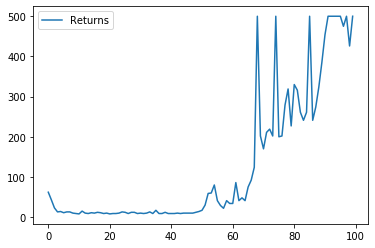
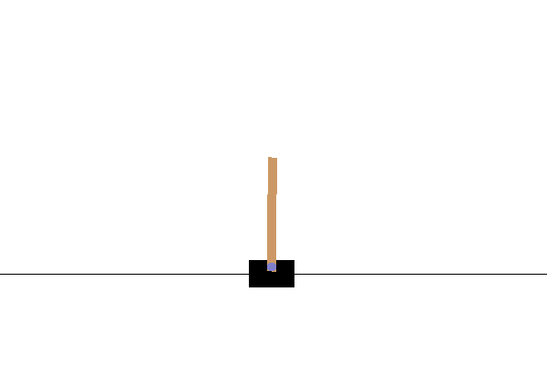

# Implementações de Aprendizado por Reforço

## Shared Network AAC

Advantage Actor Critic com uma rede neural compartilhada entre o Actor e o Critic.

Curva de Aprendizado:

Shared AAC após 100 episódios:

## PPO

Proximal Policy Optimization com GAE

## Shared Network PPO

Shared Network Proximal Policy Optimization com GAE

Curva de Aprendizado:

## Soft Actor Critic

Soft Actor Critic

BipedalWalker-v2 após 170 episódios

Pendulum-v0:

Curva de Aprendizado:

