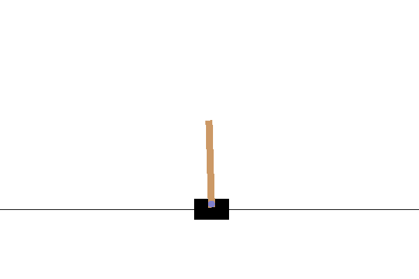
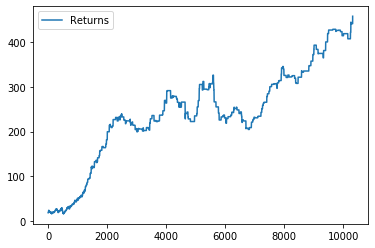
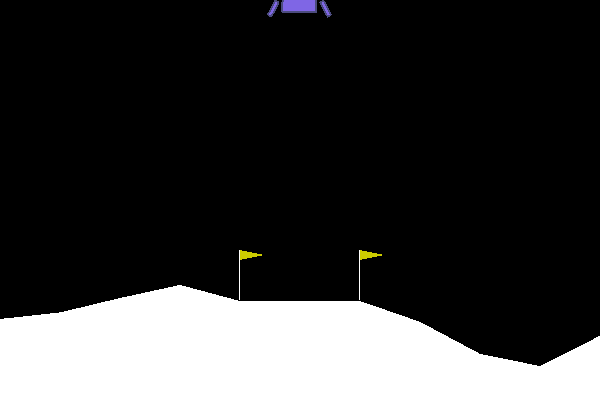
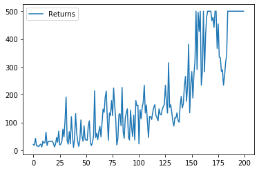
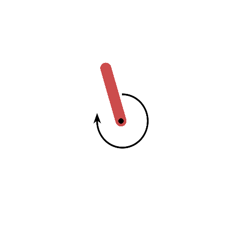
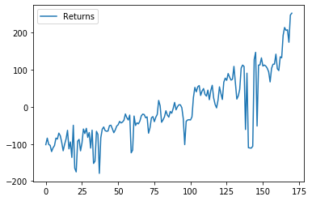

# Implementações de Aprendizado por Reforço

## A2C

Advantage Actor Critic com Generalized Advantage Estimator

### CartPole

Após 10000 timesteps

Curva de Aprendizado:

## PPO

Proximal Policy Optimization com GAE

## Shared Network PPO

Shared Network Proximal Policy Optimization com GAE

Curva de Aprendizado:

## Soft Actor Critic

Soft Actor Critic

BipedalWalker-v2 após 170 episódios

Pendulum-v0:

Curva de Aprendizado:

